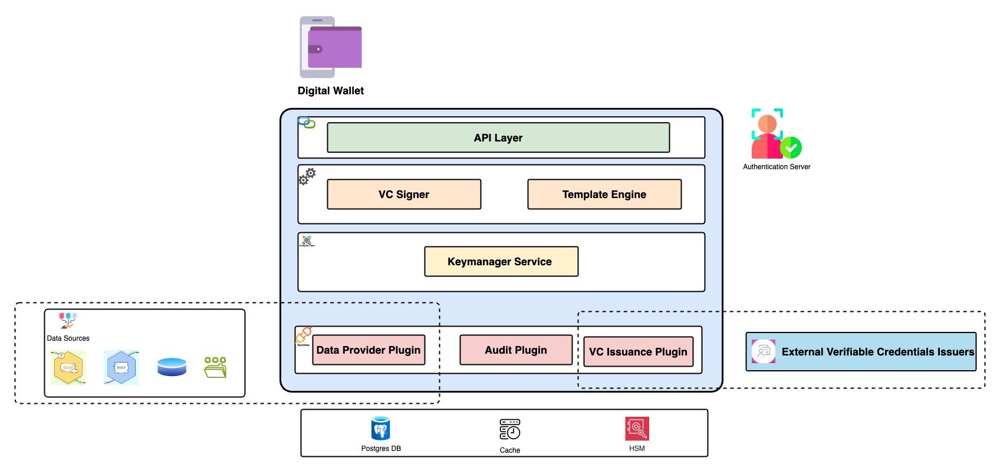

# Components

Inji Certify leverages the following components (from existing building blocks/products):

<figure><figcaption></figcaption></figure>

This layered component diagram represents the architecture of the Inji Certify system. The diagram is organized into four distinct layers, each representing a different aspect of the system's functionality:

1. **API Layer**

* This layer serves as the entry point for external interactions with the system.
  * It exposes various APIs that allow clients to interact with the underlying services.

2. **VC Signer and Template Engine**

* This layer is responsible for the creation and signing of Verifiable Credentials (VCs).
  * The Template Engine component within this layer handles the generation of credential templates.
  * The VC Signer component ensures that the credentials are properly signed and verifiable.

3. **Keymanager Service**

* This layer manages cryptographic keys used for signing and verifying credentials.
  * It ensures the secure storage and retrieval of keys, and handles key rotation and management tasks.

4. **Plugin interaction**

* This foundational layer consists of three plugins that provide essential services to the upper layers:
  * **Data Provider Plugins:** These plugins fetch relevant data from external sources or registries. They retrieve the necessary information and return it to Inji Certify as a JSON object. Inji Certify then utilizes this data to generate and issue the corresponding VCs..
  * **Audit Plugin**: Tracks and logs actions within the system for auditing purposes.
  * **VC Issuance Plugin**: Exposes API for VCI Issuance which internally connects with credential service and sends the Verifiable Credential (VC) issued by the service as a response.

Each layer builds upon the services provided by the layer below it, creating a modular and scalable architecture for the Inji Certify system.
