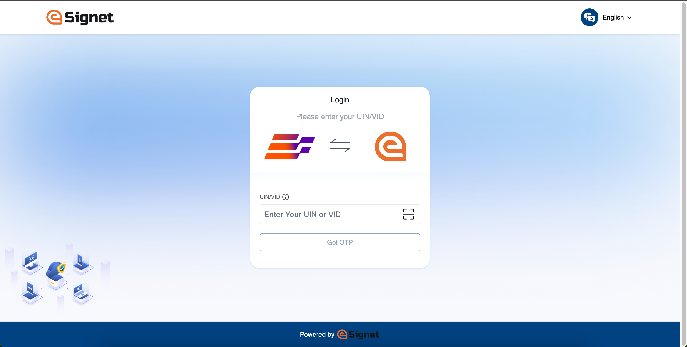
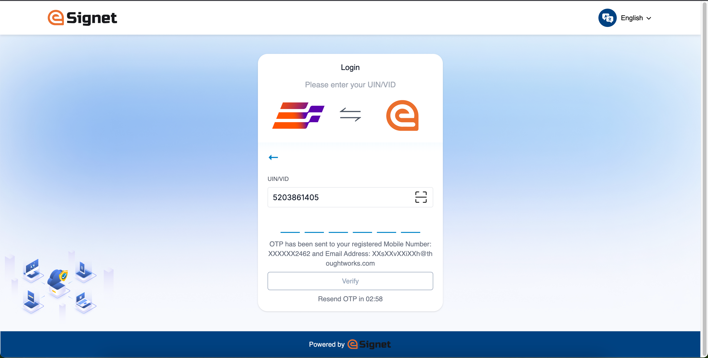

# End User Guide


**Important**: We are in the process of updating screenshots and content in the End User Guide to reflect our new branding. These updates will be available soon, thank you for your patience!


# Overview
Inji Wallet (Web) End User Guide is structured as below:

- Interface Overview
- Download National ID VC as PDF
- Download Insurance VC as PDF
- Preference
  - Change Language

## Interface Overview
Inji Wallet (Web) is akin to Inji Wallet with a web interface which is fully responsive and accessible over Desktop, Tablet and Mobile browsers. Interface Overview provides you a high level interface view (Desktop View) of the portal and labels the interface elements/items to let you quickly find an item referred to throughout this guide.
- Main Menu
- Workspace
- Search box
- List of Issuers

  <figure><figcaption>
Interface Overview
</figcaption></figure>

## Downloading National ID VC as PDF

You can download your National ID, here we will see how to do it when we use eSignet for Authentication which is to use OTP.

What details I need to provide to download my credential?
The credential issuer would have provided details like UIN/VID in case of MOSIP National ID or Policy number, Name, and DoB for an Insurance card. You need to enter these information to be able to download Insurance VC.

To download a National ID VC using eSignet as authentication layer (OTP method)

- Launch the Inji Wallet (Web) in your web browser, The home page presents you with the list of Issuers. You can also use the 'Search' box to search through and quickly find the Issuer (Credential Issuer) you are looking for.

<figure><figcaption>
Launch application
</figcaption></figure>

  - Locate and click on an 'Issuer' tile on the Workspace, Or
  - Search for an issuer by name in **Search** box and click to proceed, Note: On selecting an 'Issuer Type', it takes you to next page where you select the 'Credential Type' to download as PDF.

- Select the 'Credential Type', It takes you to 'Validity Screen'

<figure><figcaption>
Search issuer
</figcaption></figure>

- Validity step: On validity screen you can choose to decide the 1. Number of times a credential can be used, choose from drop down (once, twice or ..). Click ok and proceed, It takes you to next page for authentication (eSignet), <!-- Write what field you input here. -->

<>

- On eSignet authentication page enter UIN/VID and click on 'Get OTP', a next will appear asking you to enter OTP
  

<figure><figcaption>
Authentication page
</figcaption></figure>

- Enter the OTP you received and click Verify.

<figure><figcaption>
Enter OTP
</figcaption></figure>

- A download progress screen appears
<figure><figcaption>
Verify OTP
</figcaption></figure>

- PDF will be generated and stored in the Downloads folder of the system. <!-- Misleading statement : Credential is downloaded in the background and -->

<figure><figcaption>
Successful Download
</figcaption></figure>

- You can view the PDF of the downloaded VC (National ID) from download folder.

<figure><figcaption>
Downloaded National ID VC as PDF
</figcaption></figure>

## Downloading Insurance ID VC as PDF

You can download your Insurance ID, here we will see how to do it when we use eSignet for Authentication which is to use OTP.

Q - What details do I need to provide to download my credential?
A - The credential issuer must have provided details Policy number, Name and DoB for an Insurance card. This information has to be fed to the authentication system to enable download.

To download an Insurance ID VC using eSignet for authentication (KBI method), follow the step below:

- Launch the Inji Web application in your web browser. The home page presents you with the list of Issuers. You can also use the 'Search' box to quickly find an Issuer (Insurance VC).

<figure><figcaption>
Launch application
</figcaption></figure>

- Click on a particular 'Issuer' to land in **Credential Types** selection page. <!-- Screenshot here will change .. currently it is howing that of searched result --->

<figure><figcaption>
Search issuer
</figcaption></figure>

- On the Credentials Types selection page, choose a credential type from the List of Credentials section, 'Credential Validity' screen will appear.

<figure><figcaption>
Credential Types page
</figcaption></figure>

- On 'Credential Validity' screen you can choose to decide the 1. Number of times a credential can be used, choose from drop down (once, twice or unlimited). Click ok and proceed, It takes you to next page for authentication (eSignet), <!-- Write what field you input here. -->

**Note**: All the fields are mandatory.

<figure><figcaption>
Authentication page
</figcaption></figure>

- On eSignet authentication page enter Policy Number, Name and DOB, and click on 'Login'. Credential is downloaded in the background and PDF will be generated and stored in the Downloads folder of the system.
  

<figure><figcaption>
Authentication page
</figcaption></figure>

- A download progress screen appears
<figure><figcaption>
Verify OTP
</figcaption></figure>

- PDF will be generated and stored in the Downloads folder of the system. <!-- Misleading statement : Credential is downloaded in the background and -->

<figure><figcaption>
Successful Download
</figcaption></figure>

- You can view the PDF of the downloaded VC (National ID) from download folder.

<figure><figcaption>
Downloaded National ID VC as PDF
</figcaption></figure>

<!-- 

Also include 'Don't have an account? Signup with Unified Login.

-->

## Preference

## Language Selection

You can choose your preferred language using 'language Selection' options available on the Main-Menu. Inji Web now supports 4 International Language (English, French and Arabic) and 3 Indian Languages (Tamil, Hindi and Kannada).

<figure><figcaption>
Language Selection
</figcaption></figure>

<!-- 

Overview

The End-User-Guide for Inji Wallet (Web) helps you with 
- 'Downloading National ID VC as PDF'
- 'Download of Insurance ID VC as PDF'

also mention here within the intro the following:

Time bound VC storage
- Landing page

-->

<!-- 

Overview

The End-User-Guide for Inji Wallet (Web) helps you with 'Downloading National ID VC as PDF' , 'Download of Insurance ID VC as PDF' along with how you can select/choose a language or where you can look for help.

also mention here within the intro the following:

Time bound VC storage
- Landing page
- Responsive view: Details on how the application adapts to different device views, including mobile and tablet devices.

- Interface Overview // Have one large screenshots mark/highlight the areas, also enlist the areas where you will find what. // Say - Inji Wallet is akin to inji wallet with a web interface.
- Download of National ID VC as PDF
- Download of Insurance ID VC as PDF
- Language Selection:
- Language Selection: Guidance on selecting the preferred language for the application.
Responsive Views:
- Help: Information on how to access help and support.

- Time bound VC storage
- Landing page
- Responsive view: Details on how the application adapts to different device views, including mobile and tablet devices.

-->

<!--

Interface Overview

// Have one large screenshots mark/highlight the areas, also enlist the areas where you will find what.

// Say - Inji Wallet is akin to inji wallet with a web interface.

## Downloading National ID VC as PDF

You can download your National ID, here we will see how to do it when we use eSignet for Authentication which will use OTP.

What details I need to provide to download my credential?
The credential issuer would have provided details like UIN/VID in case of MOSIP National ID or Policy number, Name and DoB for an Insurance card. This information has to be fed to the authentication system to enable download.

To download a National ID VC using eSignet as authentication layer (OTP method)

**Step1**: Launch the Inji Wallet (Web) in your web browser, The home page presents you with the list of Issuers. You can also use the 'Search' box to search through and quickly find the Issuers (Credential Issuer).

<figure><figcaption>
Launch application
</figcaption></figure>

**Step1.1**: Search for an issuer by name in **Search** box.

<figure><figcaption>
Search issuer
</figcaption></figure>

**Step2**: Click on a 'Credential Type' tile, It takes you to next page for authentication (eSignet), // Write what field you input here.

<figure><figcaption>
Credential Type page
</figcaption></figure>

**Step2.1**: Provide the required details. **Note**: All the fields are mandatory.

<figure><figcaption>
Authentication page
</figcaption></figure>

<figure><figcaption>
Enter details
</figcaption></figure>

<figure><figcaption>
Enter OTP
</figcaption></figure>

<figure><figcaption>
Verify OTP
</figcaption></figure>

**Step3**: Credential is downloaded in the background and PDF will be generated and stored in the Downloads folder of the system.

<figure><figcaption>
Successful Download
</figcaption></figure>

**Step4**: Upon successful PDF generation, user can view the PDF of the downloaded VC (National ID).

<figure><figcaption>
Downloaded National ID VC as PDF
</figcaption></figure>

-->

<!-- 

## Downloading Insurance ID VC as PDF

You can download your Insurance ID, here we will see how to do it when we use eSignet for Authentication which is to use OTP.

Q - What details I need to provide to download my credential?
A - The credential issuer would have provided details Policy number, Name and DoB for an Insurance card. This information has to be fed to the authentication system to enable download.

To download an Insurance ID VC using eSignet for authentication (KBI method), follow the step below:

**Step1**: Launch the Inji Web application in your web browser. The home page presents you with the list of Issuers. You can also use the 'Search' box to quickly find an Issuer (Insurance VC).

<figure><figcaption>
Launch application
</figcaption></figure>

<figure><figcaption>
Search issuer
</figcaption></figure>

**Step2**: click on issuers' tile to land in **Credential Types** selection page.

<figure><figcaption>
Credential Types page
</figcaption></figure>

**Step4**: In the Credentials Types selection page, choose a credential type from the List of Credentials section.

<figure><figcaption>
Credential Type selection
</figcaption></figure>

**Step5**: Click on a Credential Type tile and authenticate in the eSignet page by providing the required details.

**Note**: All the fields are mandatory.

<figure><figcaption>
Authentication page
</figcaption></figure>

<figure><figcaption>
Enter details
</figcaption></figure>

<figure><figcaption>
Redirection
</figcaption></figure>

**Step5**: Credential is downloaded in the background and PDF will be generated and stored in the Downloads folder of the system.

<figure><figcaption>
Download in progress
</figcaption></figure>

<figure><figcaption>
Download successful
</figcaption></figure>

**Step6**: Upon successful PDF generation, user can view the PDF of the downloaded VC (Insurance ID).

<figure><figcaption>
Downloaded Insurance VC as PDF
</figcaption></figure>

-->

<!-- 

Also include 'Don't have an account? Signup with Unified Login.

-->

<!-- 

**Old Content**

This document serves as a concise guide for end users, providing comprehensive step-by-step information on the features and functionalities offered by Inji Web.

## Download of National ID VC as PDF

To download a National ID VC using eSignet as authentication layer (OTP method), please follow the below mentioned steps:

**Step1**: Launch the Inji Web application in your web browser.

<figure><figcaption>
Launch application
</figcaption></figure>

**Step2**: Search for an issuer by name in **Search** box.

<figure><figcaption>
Search issuer
</figcaption></figure>

**Step3**: In the Home page, from the section, **List of Issuers** section, click on issuers' tile to land in **Credential Types** selection page.

<figure><figcaption>
Credential Type page
</figcaption></figure>

**Step4**: Click on a Credential Type tile and authenticate in the eSignet page by providing the required details.

**Note**: All the fields are mandatory.

<figure><figcaption>
Authentication page
</figcaption></figure>

<figure><figcaption>
Enter details
</figcaption></figure>

<figure><figcaption>
Enter OTP
</figcaption></figure>

<figure><figcaption>
Verify OTP
</figcaption></figure>

**Step5**: Credential is downloaded in the background and PDF will be generated and stored in the Downloads folder of the system.

<figure><figcaption>
Successful Download
</figcaption></figure>

**Step6**: Upon successful PDF generation, user can view the PDF of the downloaded VC (National ID).

<figure><figcaption>
Downloaded National ID VC as PDF
</figcaption></figure>

## Download of Insurance ID VC as PDF

To download a Insurance ID VC using eSignet as authentication layer (KBI method), please follow the below mentioned steps:

**Step1**: Launch the Inji Web application in your web browser.

<figure><figcaption>
Launch application
</figcaption></figure>

**Step2**: Search for an issuer by name in **Search** box.

<figure><figcaption>
Search issuer
</figcaption></figure>

**Step3**: In the Home page, from the section, **List of Issuers** section, click on issuers' tile to land in **Credential Types** selection page.

<figure><figcaption>
Credential Types page
</figcaption></figure>

**Step4**: In the Credentials Types selection page, choose a credential type from the List of Credentials section or Search for a credential type in the search box.

<figure><figcaption>
Credential Type selection
</figcaption></figure>

**Step5**: Click on a Credential Type tile and authenticate in the eSignet page by providing the required details.

**Note**: All the fields are mandatory.

<figure><figcaption>
Authentication page
</figcaption></figure>

<figure><figcaption>
Enter details
</figcaption></figure>

<figure><figcaption>
Redirection
</figcaption></figure>

**Step5**: Credential is downloaded in the background and PDF will be generated and stored in the Downloads folder of the system.

<figure><figcaption>
Download in progress
</figcaption></figure>

<figure><figcaption>
Download successful
</figcaption></figure>

**Step6**: Upon successful PDF generation, user can view the PDF of the downloaded VC (Insurance ID).

<figure><figcaption>
Downloaded Insurance VC as PDF
</figcaption></figure>

-->