# End User Guide

## End User Guide

## Overview

Inji Wallet (Web) End User Guide is structured as below:

* Interface Overview
* Download National ID VC as PDF
* Download Insurance VC as PDF
* Preference
  * Change Language

## Interface Overview

Inji Wallet (Web) is akin to Inji Wallet with a web interface which is fully responsive and accessible over Desktop, Tablet and Mobile browsers. Interface Overview provides you a high level interface view (Desktop View) of the portal and labels the interface elements/items to let you quickly find an item referred to throughout this guide.

* Main Menu
* Language
* Workspace
* Search
*   Issuers

    <figure>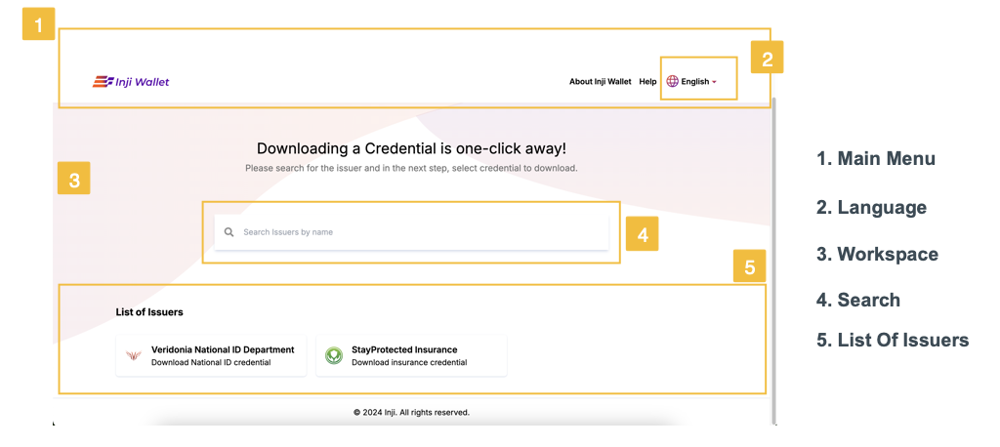<figcaption>
Interface Overview
</figcaption></figure>

## Download VCs

### Downloading National ID VC as PDF

You can download your National ID, here we will see how to do it when we use eSignet for Authentication which is to use OTP.

What details I need to provide to download my credential? The credential issuer would have provided details like UIN/VID in case of MOSIP National ID or Policy number, Name, and DoB for an Insurance card. You need to enter these information to be able to download Insurance VC.

To download a National ID VC using eSignet as authentication layer (OTP method)

* Launch the Inji Wallet (Web) in your web browser, The home page presents you with the list of Issuers. You can also use the 'Search' box to search through and quickly find the Issuer (Credential Issuer) you are looking for.

<figure>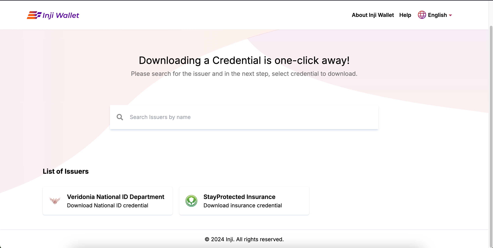<figcaption>
Launch application
</figcaption></figure>

* Locate and click on an 'Issuer' tile on the Workspace, Or
* Search for an issuer by name in **Search** box and click to proceed, Note: On selecting an 'Issuer Type', it takes you to next page where you select the 'Credential Type' to download as PDF.
* Select the 'Credential Type', It takes you to 'Validity Screen'

<figure>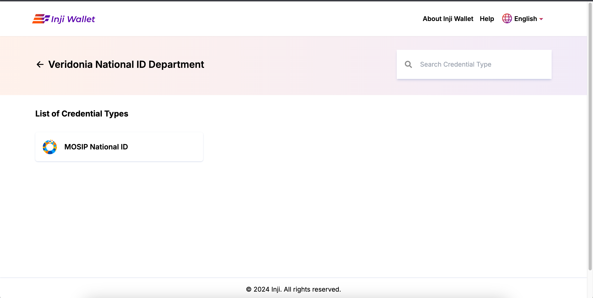<figcaption>
List Of Credential Type
</figcaption></figure>

* On validity screen you can choose to decide the number of times a credential can be used, choose from drop down (Once, Twice, Unlimited or Custom ). Click ok and proceed, It takes you to next page for authentication (eSignet).
* On eSignet authentication page enter UIN/VID and click on 'Get OTP', a next will appear asking you to enter OTP

<figure>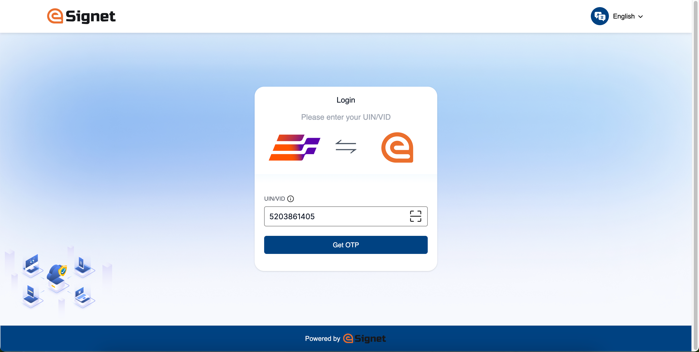<figcaption>
Authentication page
</figcaption></figure>

* Enter the OTP you received and click Verify.

<figure>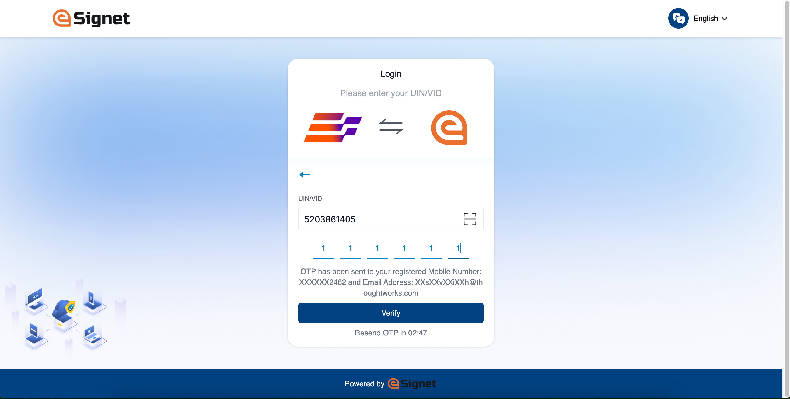<figcaption>
Enter OTP
</figcaption></figure>

* A download progress screen appears.

<figure>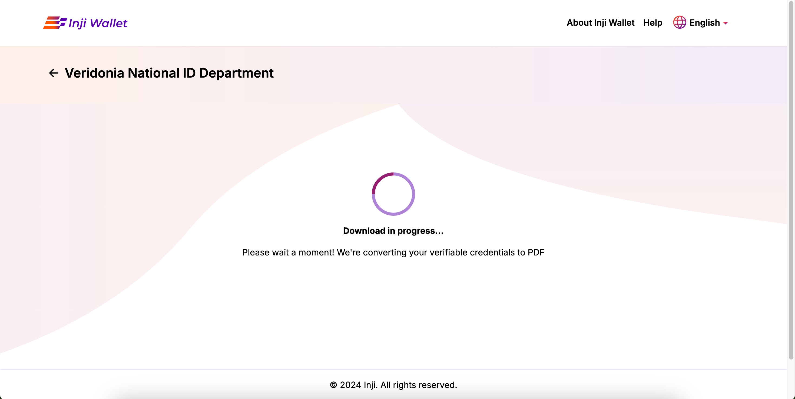<figcaption>
Verify Progress
</figcaption></figure>

* PDF will be generated and stored in the Downloads folder of the system.

<figure>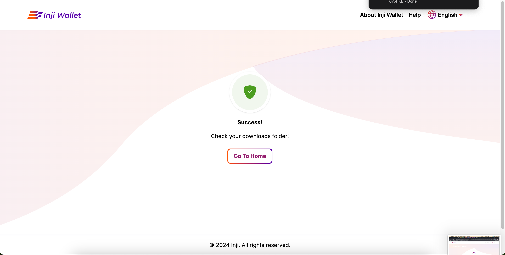<figcaption>
Download Success
</figcaption></figure>

* You can view the PDF of the downloaded VC (National ID) from download folder.

<figure>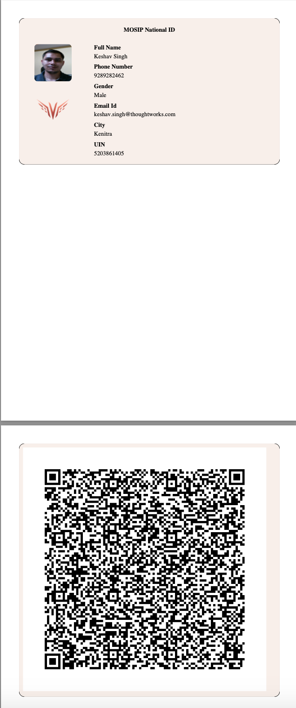<figcaption>
Downloaded National ID VC as PDF
</figcaption></figure>

### Downloading Insurance VC as PDF

You can download your Insurance VC, here we will see how to do it when we use eSignet for Authentication, which is to use OTP.

**Q - What details do I need to provide to download my credential?**

**A** - The credential issuer must have provided details Policy number, Name and DoB for an Insurance card. This information has to be fed to the authentication system to enable download.

To download an Insurance ID VC using eSignet for authentication (KBI method), follow the step below:

* Launch the Inji Web application in your web browser. The application home page presents you with the list of Issuers. You can also use the 'Search' box to quickly find an Issuer (Insurance VC Issuer). Click on a particular 'Issuer' (Insurance VC Issuer), you will land to its **Credential Types** selection page.

<figure>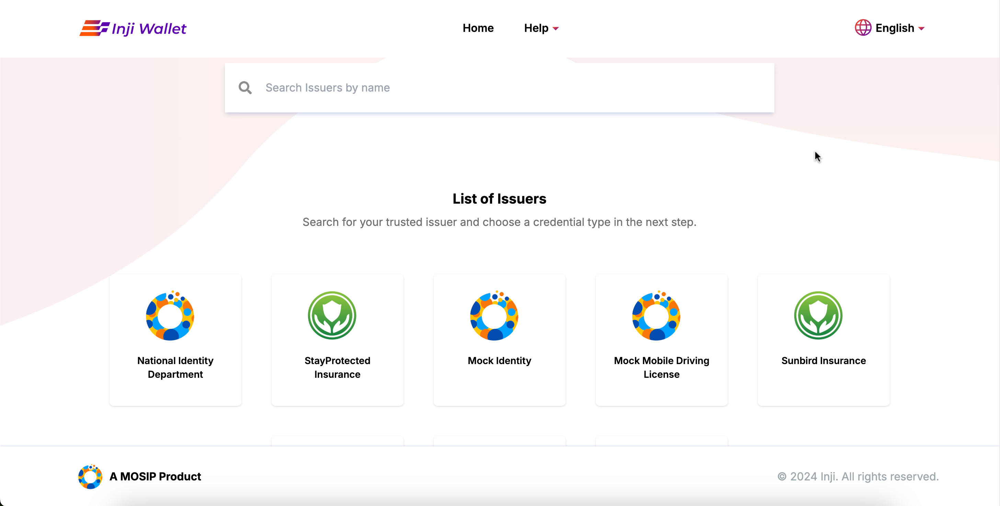<figcaption>
Launch application
</figcaption></figure>

* On the **Credentials Types** page, choose a credential type from the List of Credentials section, 'Credential Validity' screen will appear.

<figure>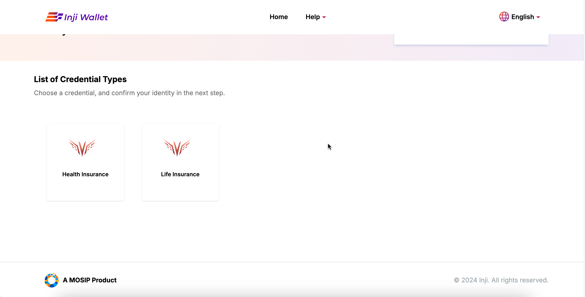<figcaption>
List Of Issuers
</figcaption></figure>

* On 'Credential Validity' screen you can choose to decide the number of times a credential can be used, choose from drop down (once, twice, unlimited or custom). Click ok and proceed, It takes you to next page for authentication (eSignet).

<figure>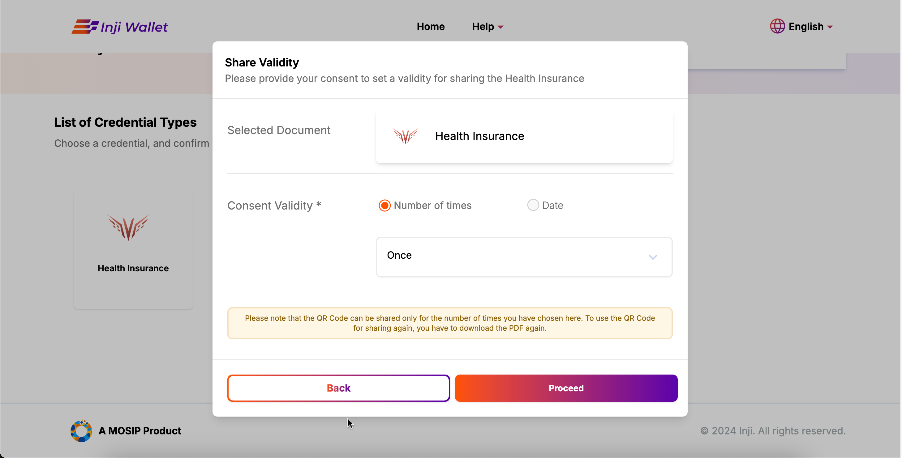<figcaption>
VC Validity
</figcaption></figure>

* On eSignet authentication page enter Policy Number, Name and DOB, and click on 'Login'. **Note**: All the fields are mandatory.

<figure>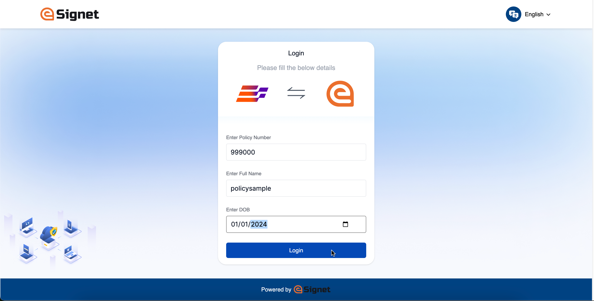<figcaption>
Authentication page
</figcaption></figure>

Credential is downloaded in the background and PDF will be generated and stored in the Downloads folder of the system (A download progress screen can also be seen when the credential is being downloaded).

<figure>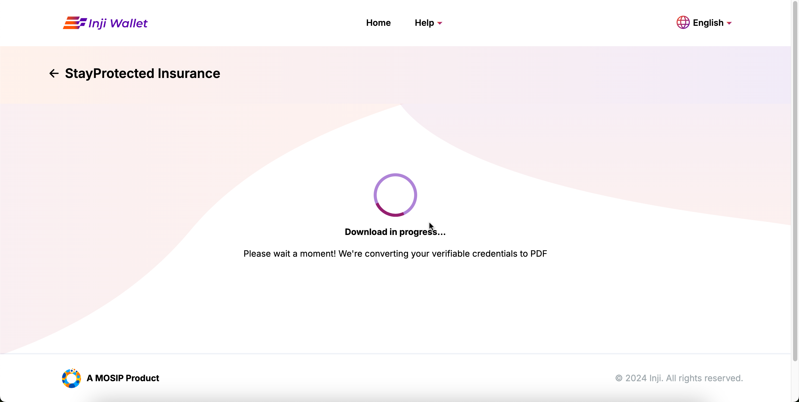<figcaption>
Download Progress
</figcaption></figure>

* The generated pdf is stored in the Downloads folder of the system.
* You can view the PDF of the downloaded VC (Insuran) from download folder.

<figure>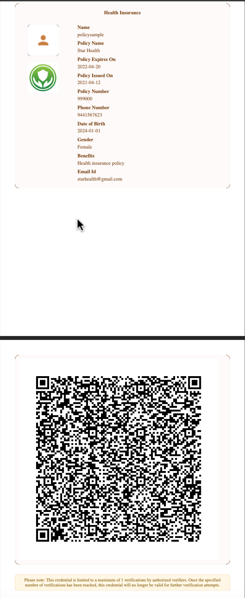<figcaption>
Downloaded Insurance VC as PDF
</figcaption></figure>

## Preference

### Language Selection

You can choose your preferred language using 'language Selection' options available on the Main-Menu. Inji Web now supports 4 International Language (English, French and Arabic) and 3 Indian Languages (Tamil, Hindi and Kannada).

<figure>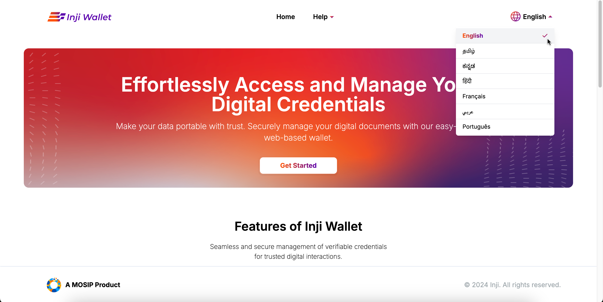<figcaption>
Language Preference
</figcaption></figure>
