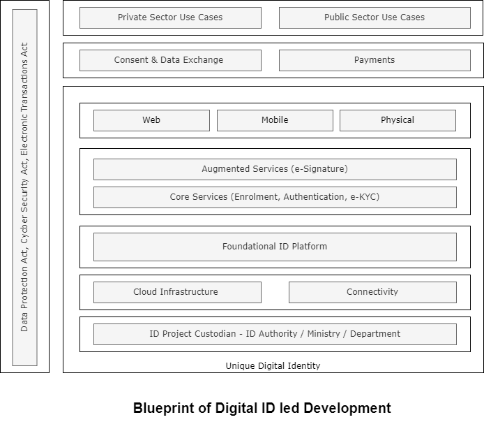

# Architecture

[MOSIP](https://www.mosip.io/#1) as it stands is a modular microservice based architecture. It's modularity helps in adoption of MOSIP at complex situations. Most of the [MOSIP modules](../modules/) are designed to be a strong foundation infrastructure modules and can be adopted in several projects.

MOSIP is designed with the following architecture principles. These architecture principles are core to the development of the system's feature and has a great influence on how and why specific software design patterns are used within.

* Data Privacy
* No Vendor Lock-in
* Open Standards
* Async/ Offline First
* Commodity Computing
* Fault tolerant
* Manageable
* Secure By Default

### Overview

<figure><figcaption>
Architecture Overview
</figcaption></figure>

To know how MOSIP can be deployed, refer [Getting Started](https://docs.mosip.io/1.2.0/deploymentnew/getting-started). The different installation models are detailed out in the [Deployment](https://docs.mosip.io/1.2.0/deploymentnew) section.

### High-Level Reference Functional Architecture

<figure><figcaption></figcaption></figure>

#### Overview 

This reference blueprint provides a comprehensive vision for designing and implementing a Digital ID-led DPI infrastructure. It outlines how foundational identity systems can be leveraged alongside key DPI components, enabling various use cases across both the public and private sectors. The blueprint is structured in layers of technology, governance, and service delivery, ensuring scalability, inclusivity, and compliance with legal frameworks. Below is an explanation of its core components and their roles within the ecosystem.

#### Unique Digital Identity 

At the core of the system is the Unique Digital Identity, which establishes a singular, definitive identity for every individual. This digital identity forms the backbone of all operations, ensuring secure identification and verification across diverse domains.

#### Governance 

The ID Project Custodian, whether a designated authority, ministry, or department, oversees this infrastructure. This custodian is crucial for maintaining governance, regulatory compliance, and operational efficiency, ensuring that all identity services align with national policies and frameworks.

#### Infrastructure Layer 

Supporting the ecosystem is a robust Infrastructure Layer, consisting of cloud infrastructure and connectivity. The cloud ensures scalability, resilience, and the ability to manage large volumes of identity data. The connectivity layer ensures the system's accessibility, making it functional in both urban and remote areas.

#### Foundational ID Platform 

At the heart of the blueprint is the Foundational ID Platform, a centralized framework for issuing and managing foundational IDs. This platform underpins all identity-related services, ensuring secure identity handling and enabling core functions like registration, lifecycle management, verification, authentication, and e-KYC (Electronic Know Your Customer). These services are essential for building trusted interactions across all sectors.

#### Services 

Now that we have established the core layers to anchor trust, we can expand functionality through augmented services, such as **eSignature** capabilities. These enable secure digital transactions and help governments transition from traditional in-person signatures. These added features enhance the system's utility, which is especially crucial for enabling paperless workflows.

#### Accessibility and Inclusivity 

To ensure widespread adoption and accessibility, the system features a Multi-Channel Access Layer that enables interaction through **web**, **mobile (Apps,USSD)**, and **physical interfaces(QR)**. This design ensures inclusivity by accommodating individuals with diverse backgrounds and varying levels of technological proficiency, to interact with the system effortlessly.

#### Consent Management and Data Exchange 

In addition to its core and augmented services, consent management and data exchange capabilities are crucial for advancing digitization and digital development. These capabilities facilitate the regulated sharing of information across both public and private platforms. Moreover, the integration of payment systems adds significant value to Government-to-People (G2P) use cases. Additionally, data exchange can be further enhanced through the use of Verifiable Credentials.

#### Use Cases and Benefits Delivery 

This blueprint is designed to act as a catalyst for seamless service delivery and impactful use cases across both the private and public sectors. It is essential to involve the private sector in the digitization process, as it plays a key role in enabling services such as banking, e-commerce, and telecommunications, thereby streamlining operations. In the public sector, this blueprint enhances service delivery in areas like social welfare, healthcare, taxation, and education, contributing to better governance and increased citizen engagement. By adopting an overall ID-led approach, it not only accelerates the adoption of digital identity but also ensures improved governance, streamlined operations, and enhanced citizen participation.

#### Legal and Regulatory Framework 

Finally, the framework operates within a robust legal and regulatory environment, complying with key legislation such as the Data Protection Act, the Cybersecurity Act, and the Electronic Transactions Act. These laws safeguard data privacy and security, ensuring that the system operates transparently, trustworthily, and in full legal compliance.
