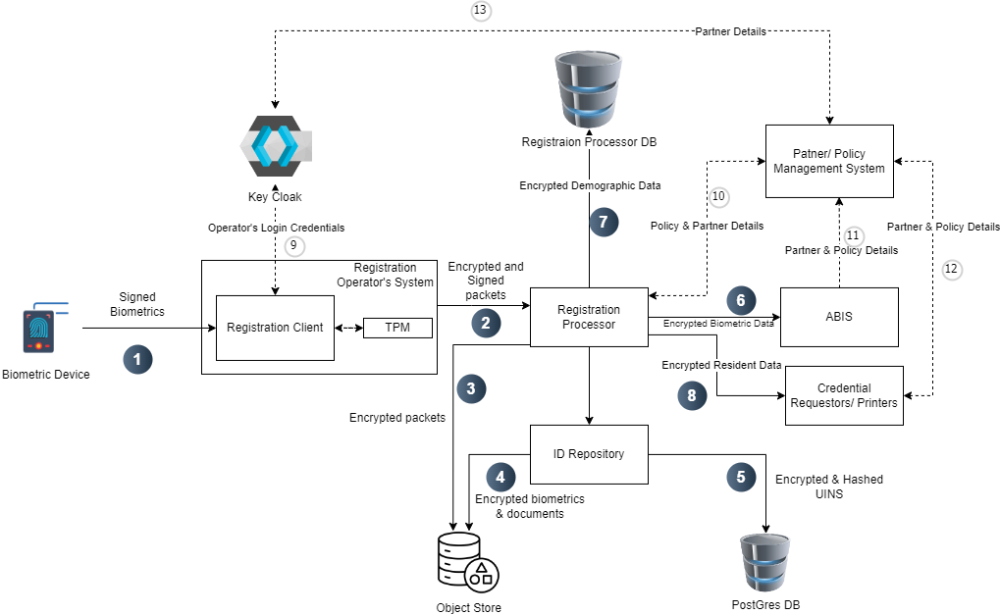

# Data Protection

The security of user data is given the highest priority in MOSIP. Data is protected in flight and rest using strong cryptographic techniques. All operations on decrypted data are done in memory.

Various flows with encryption are illustrated below. Refer to [Keys](../../../id-lifecycle-management/supporting-services/keymanager/keys.md) for all references of the type 'Kx' and 'KPx'.

## Registration data flow

The below diagram represents a registration data flow system for biometric authentication and identity management.

<figure><figcaption>
Registration Data Flow
</figcaption></figure>

1. **Biometric Capture:**
   * A biometric device captures and signs biometric data before sending it to the **Registration Client (PK2)**. Then registration client verifies the signature
2. **Registration & Encryption:**
   * The **Registration Client**, running on the operator’s system, receives biometric data and securely encrypts it into packets.
   * The client always refers to **Keycloak** for authentication, ensuring that only authorized operators can access the system.
   * [Registration Client](https://docs.mosip.io/1.2.0/modules/registration-client) signs the packet using the TPM key of the machine (K10) and encrypts the packet using MOSIP public key specific to (the registration centre, machine id) combination (K11).
3. **Data Processing & Storage:**
   * The encrypted packets are transmitted to the **Registration Processor**, which processes and signs the data.
   * The processed data is then stored in the **Object Store** and **ID Repository** for further use.
4. **Secure Storage of Biometric Data:**
   * [ID Repository](https://docs.mosip.io/1.2.0/modules/id-repository) encrypts biometrics, demographics, and documents and stores them in the Object Store. (K7.1,K7.2,K7.3)
5. **Hashed UIN Storage:**
   * The UINs are hashed, encrypted, and stored in `uin` the table of `mosip_idrepo` DB. (K7.4)
6. **Data Sharing & Policy Enforcement:**
   * When encrypted biometric data needs to be shared, it is sent to **ABIS** for authentication.
   * The system consults the **Partner/Policy Management System** to verify partner details and enforce data-sharing policies.
   * Only partners who have registered and authenticated via **Keycloak** can access the **Partner Management System**, where they must subscribe to specific policies to receive data.
7. **Demographic Data Storage:**
   * Encrypted demographic data is stored in the **Registration Processor Database**. (K11)
8. **Credential Issuance:**
   * Encrypted resident data is shared with **credential requestors and printers** based on the subscribed policies. (K12)
9. **Operator Authentication:**
   * The **Registration Client** checks **Keycloak** to ensure that only authenticated operators can perform registrations.
10. **Policy Validation for Data Transfer:**

* Before transferring encrypted data to **ABIS, partners, or credential requestors**, the system refers to the **Partner/Policy Management System** to validate policies.

11\. **Partner & Policy Control:**

* The **Partner Management System** is controlled by **Keycloak**, ensuring that only registered partners with valid credentials can subscribe to and enforce policies for data access. (11,12,13)

## Datashare

Data shared with all partners like ABIS, Print, Adjudication, IDA, etc. is encrypted using partners' public key. Note that IDA is also a partner, however, a special partner in the sense that data is additionally zero-knowledge encrypted before sending to IDA (see the section below).

## Zero-knowledge encryption

The [ID Authentication](../../../id-lifecycle-management/identity-verification/id-authentication.md) module (IDA) is independent and may be hosted by several providers. IDA hosts all the biometric templates and demographic data. Unique additional protection is provided here to make sure that mass decryption of user data is very difficult to achieve. The data can only be decrypted if the user's UIN is provided. Here is the encryption scheme:

### Encryption and sharing by Credential Service

1. Generate master symmetric encryption key K9.
2. Generate a 10,000 symmetric keys pool (ZKn). Encrypt each ZKn with K9 and store it in DB. (K12)
3. Randomly select one key from ZKn, and decrypt using K9.
4. Derive new key ZKn' = ZKn + UIN/VID/APPID.
5. Encrypt biometric templates and demographics.
   * BIO = encrypt(bio/demo with ZKn').
6. Encrypt ZKn (this is done to share ZKn with IDA).
   * ZKn-IDA = encrypt(ZKn with K22)
7. Share the following with IDA:
   1. ZKn-IDA
   2. BIO
   3. Random index (0 - 9999)
   4. SHA-256 hash of UIN/VID/APPID
8. Share data in step 7 via standard [Datashare encryption](data-protection.md#datashare) (which encrypts entire data with PK8).

### Decryption by IDA

1. Generate master symmetric encryption key K18.
2. Decrypt data in Step 8 above using PK8.
3. Decrypt ZKn-IDA with K22 to get ZKn.
4. Encrypt ZKn with K18 and store it at a random index.
5. Bio-data is stored as is.

## ID authentication flow

1. L1 devices contain [FTM](../../../id-lifecycle-management/supporting-components/biometrics/ftm.md) to encrypt (DE1, K21) and sign (FK1) biometrics at the source and send them to the authentication client.
2. The authentication client further encrypts the auth request with the IDA-PARTNER public key.
3. IDA decrypts zero-knowledge data as given in [Step 4](data-protection.md#encryption-and-share-by-credential-service) and then performs a demographic and/or biometric authentication.
4. The match result is returned to the Auth client. In the case of KYC, the KYC attributes are encrypted with the Partner's public key (as in [Datashare](../../../id-lifecycle-management/supporting-components/datashare.md)).
