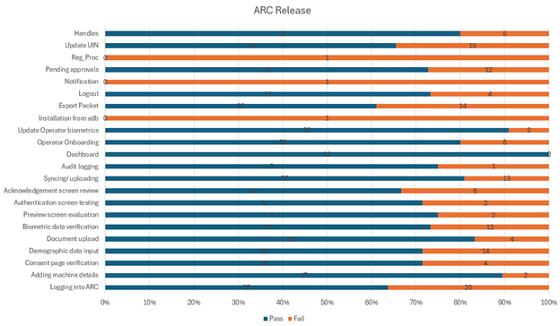

# Test Report

### Testing Scope

The scope of testing is to verify fitment to the specification from the perspective of&#x20;

●     Functionality&#x20;

●     Deployability&#x20;

●     Configurability&#x20;

●     Customizability

Verification is performed not only from the end user perspective but also from the System Integrator (SI) point of view. Hence Configurability and Extensibility of the software are also assessed. This ensures the readiness of software for use in multiple countries.

#### **The ARC (Android Reg-Client) testing scope revolves around the following flows:**

●     Logging and Logout into ARC

●     Adding machine details

●     Consent page verification

●     Demographic data input

●     Document upload

●     Biometric data verification

●     Preview screen evaluation

●     Authentication screen

●     Acknowledgement screen review

●     Syncing and uploading

●     Audit logging

●     Dashboard

●     Operator Onboarding

●     Update Operator biometrics

●     Installation from adb

●     Export Packet

●     Notification

●     Pending approvals

●     ARC packets processing in Regproc

●     New and Updated UIN

●     Handles with NRCID/Email Id/Phone Number

#### **Platform modules Coverage:**

●     Packet manager verified along with ARC

●     IDRepo sanity

●     Regproc verified along with ARC

### Test Approach 

Persona based approach has been adopted to perform the IV\&V, by simulating test scenarios that resemble a real-time implementation.

A Persona is a fictional character/user profile created to represent a user type that might use a product/or a service in a similar way. Persona based testing is a software testing technique that puts software testers in the customer's shoes, assesses their needs from the software, and thereby determines use cases/scenarios that the customers will execute. The persona's needs may be addressed through any of the following.

●     Functionality&#x20;

●     Deployability&#x20;

●     Configurability&#x20;

●     Customizability

&#x20;The verification methods may differ based on how the need was addressed.

### Verified configuration 

Verification is performed on various configurations as mentioned below

●     Default configuration - with 1 Language (English)

### Limitations or Out of Scope 

●     Update UIN

●      Handles feature with Update UIN

●      Real biometric device

#### Platform modules tested along with ARC v 0.11.0:

| Module/Repository       | Compatible Version |
| ----------------------- | ------------------ |
| id-repository           | 1.2.2.x            |
| registration-processor  |  1.2.0.x           |
| packet-manager          | 1.2.0.x            |

### Feature Health   &#x20;

<figure><figcaption>
Feature Health
</figcaption></figure>

### Test execution statistics

#### Functional test results by modules 

Below are the test metrics by performing functional testing using mock SBI and mock ABIS.&#x20;

1. **Test Metrics Overview**:
   * **Functional testing** was performed using mock SBI and mock ABI&#x53;**.**
2. **Testing Approach**:
   * **Black-box testing** was used, focusing on test cases based on the specifications of the software component.
3. **Testing Types**:
   * Functional testing was conducted in combination with:
     1. Individual module testing.
     2. Integration testing.
4. **Test Data Preparation**:
   * Test data were created based on user stories.
   * Expected results were validated by monitoring the user interface.
5. **Scope of Testing**:
   * **GUI testing**.
   * **System testing**.
   * End-to-end flows across multiple languages and configurations.
6. **Simulation Testing**:
   * Simulated multiple identity schema and corresponding UI schema configurations during the testing cycle.

<table data-full-width="true"><thead><tr><th>Total</th><th>Passed</th><th>Failed</th><th>Skipped (N/A)</th></tr></thead><tbody><tr><td>521</td><td>386</td><td>135</td><td>0</td></tr></tbody></table>

**Test Rate:** 100% With **Pass Rate:** 74%

#### UI Automation Reports:

<table data-full-width="true"><thead><tr><th>Total</th><th>Passed</th><th>Failed</th><th>Skipped (N/A)</th></tr></thead><tbody><tr><td>6</td><td>4</td><td>2</td><td>0</td></tr></tbody></table>

**Test Rate:** 100% With **Pass Rate:** 66%

#### IDRepo API Testrig Report:

<table data-full-width="true"><thead><tr><th>Total</th><th>Passed</th><th>Failed</th><th>Skipped (N/A)</th></tr></thead><tbody><tr><td>410</td><td>371</td><td>30</td><td>9</td></tr></tbody></table>

**Test Rate:** 97% With **Pass Rate:** 92%


**Note**:&#x20;

1. As per the schema email and phone number are optional in this env, so the 8 test cases are ignored. One testcase skipped in this env, verified manually. It is working fine.
2. DSL with handles was not implemented, so the verification was done manually and working fine. As implementation was not done, the DSL report was not included in the certification.


**Git Commit ID:**  355ba6d9572da313262a164a869bf6f5b0b2195d

**Client Version:** 1.2.0.1-B1

### Detailed Test metrics

Below are the detailed test metrics by performing manual/automation testing. The project metrics are derived from Defect density, Test coverage, Test execution coverage, test tracking, and efficiency.

The various metrics that assist in test tracking and efficiency are as follows:

●       **Passed Test Cases Coverage:** It measures the percentage of passed test cases. (Number of passed tests / Total number of tests executed) x 100

●      **Failed Test Case Coverage:** It measures the percentage of all failed test cases. (Number of failed tests / Total number of test cases executed) x 100

Please find the Github link for the .xlsx file [here](https://github.com/mosip/test-management/blob/master/ARC/ARC%200.11.0%20Platform%201.2.0.2/ARC_Platform_1.2.0.2_Verification_Report_latest.xlsx).
