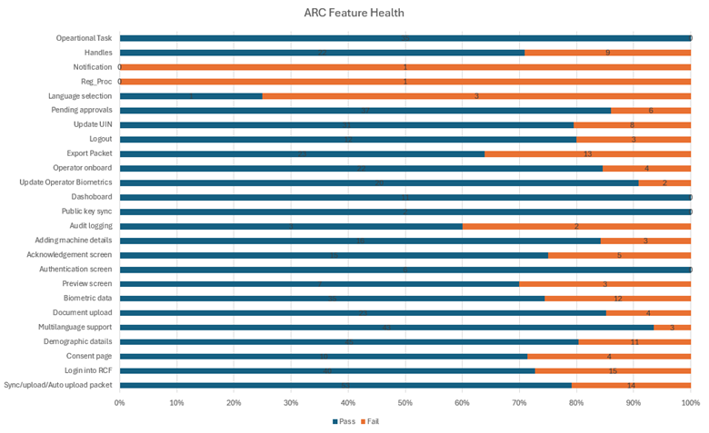

# Test Report

### Testing Scope

The scope of testing is to verify fitment to the specification from the perspective of&#x20;

●     Functionality&#x20;

●     Deployability&#x20;

●     Configurability&#x20;

●     Customizability

Verification is performed not only from the end user perspective but also from the System Integrator (SI) point of view. Hence, the software's Configuration and Extensibility are also assessed. This ensures the software's readiness for use in multiple countries.

The ARC (Android Reg-Client) testing scope revolves around the following flows:

●     Logging and Logout into ARC

●     Adding machine details

●     Consent page verification

●     Demographic data input

●     Document upload

●     Biometric data verification

●     Preview screen evaluation

●     Authentication screen

●     Acknowledgement screen review

●     Syncing and uploading

●     Audit logging

●     Dashboard

●     Operator Onboarding

●     Update Operator biometrics

●     Installation from adb

●     Export Packet

●     Notification

●     Pending approvals

●     ARC packets processing in Regproc

●     New and Updated UIN

●     Handles with NRCID/Email Id/Phone Number

●     Multilingual support

### Test Approach 

Persona based approach has been adopted to perform the IV\&V, by simulating test scenarios that resemble a real-time implementation.

A Persona is a fictional character/user profile created to represent a user type that might use a product/or a service in a similar way. Persona based testing is a software testing technique that puts software testers in the customer's shoes, assesses their needs from the software, and thereby determines use cases/scenarios that the customers will execute. The persona's needs may be addressed through any of the following.

●     Functionality&#x20;

●     Deployability&#x20;

●     Configurability&#x20;

●     Customizability

The verification methods may differ based on how the need was addressed.

### Verified configuration 

Verification is performed on various configurations as mentioned below

&#x20;    ●   Default configuration - with 3 Languages (English, French , and Arabic)

### Limitations/Out of Scope 

&#x20;    ●    Handles feature with Update UIN

&#x20;    ●     Real biometric device

### &#x20;Feature Health&#x20;

<figure><figcaption>
Feature Health
</figcaption></figure>

### Test execution statistics

#### Functional test results by modules 

Below are the test metrics by performing functional testing using mock SBI and mock ABIS. The process followed was black box testing which based its test cases on the specifications of the software component under test. The functional test was performed in combination with individual module testing as well as integration testing. Test data were prepared in line with the user stories. Expected results were monitored by examining the user interface. The coverage includes GUI testing, System testing, End-To-End flows across multiple languages and configurations. The testing cycle included the simulation of multiple identity schema and respective UI schema configurations

<table><thead><tr><th valign="top">Total</th><th valign="top">Passed</th><th valign="top">Failed</th><th valign="top">Skipped (N/A)</th></tr></thead><tbody><tr><td valign="top">638</td><td valign="top">512</td><td valign="top">126</td><td valign="top">0</td></tr></tbody></table>

**Test Rate:** 100% With **Pass Rate:** 80%

#### UI Automation Reports:

<table><thead><tr><th valign="top">Total</th><th valign="top">Passed</th><th valign="top">Failed</th><th valign="top">Skipped (N/A)</th></tr></thead><tbody><tr><td valign="top">6</td><td valign="top">4</td><td valign="top">2</td><td valign="top">0</td></tr></tbody></table>

**Test Rate:** 100% With **Pass Rate:** 66%

**Git Commit ID:** b99abfb05c91b7c3a74bdaee7459e5b220623afa

**Client Version:** 1.2.0.1-B1

### Detailed Test metrics

Below are the detailed test metrics by performing manual/automation testing. The project metrics are derived from Defect density, Test coverage, Test execution coverage, test tracking, and efficiency.

The various metrics that assist in test tracking and efficiency are as follows:

●   Passed Test Cases Coverage: It measures the percentage of passed test cases. (Number of passed tests / Total number of tests executed) x 100

●   Failed Test Case Coverage: It measures the percentage of all failed test cases. (Number of failed tests / Total number of test cases executed) x 100

Please find the Git hub link for the xls file [here](https://github.com/mosip/test-management/tree/master/ARC/ARC%200.11.0).
